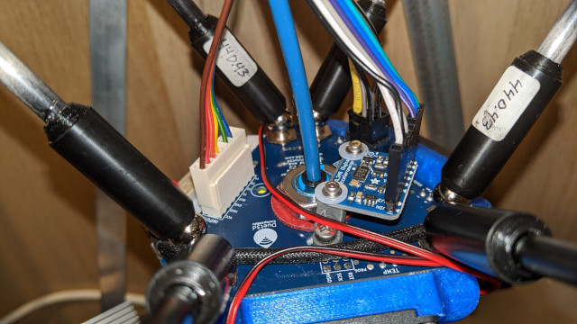
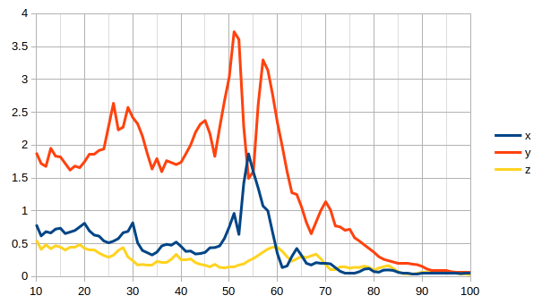
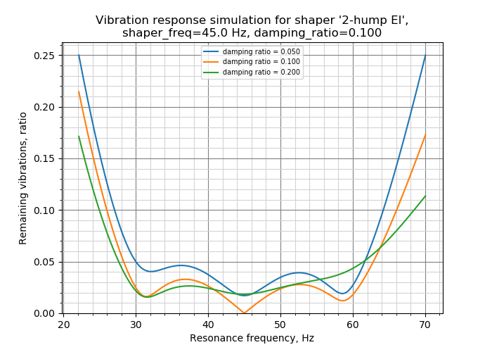

Measuring Resonances
====================

This branch provides a support for ADXL345 accelerometer, which can be used to
measure resonance frequencies of the printer for different axes. In turn, this
can be used to fine-tune input shapers. Note that using ADXL345 requires some
soldering and crimping. Also note that only Raspberry Pi setups have
been tested at this time.


Installation instructions
===========================

## Wiring

You need to connect ADXL345 to your Raspberry Pi via SPI. Note that the I2C
connection, which is suggested by ADXL345 documentation, has too low throughput
and **will not work**. You can follow the wiring instructions from
[this](https://github.com/nagimov/adxl345spi#wiring) repo (just the wiring
part). Double-check your wiring before powering up the Raspberry Pi to prevent
damaging it or the accelerometer.

## Mounting the accelerometer

The accelerometer must be attached to the toolhead. One needs to design a proper
mount that fits their own 3D printer. It is better to align the axes of the
accelerometer with the printer's axes (but if it makes it more convenient,
axes can be swapped - i.e. no need to align X axis with X and so forth - it
should be fine even if Z axis of accelerometer is X axis of the printer, etc.).

An example of mounting ADXL345 on the SmartEffector:



Note that on a bed slinger printer one must design 2 mounts: one for the
toolhead and one for the bed, and run the measurements twice.

## Software installation

Follow the instructions in the
[RPi Microcontroller document](RPi_microcontroller.md) to setup the
"linux mcu" on the Raspberry Pi.

Make sure the Linux SPI driver is enabled by running `sudo
raspi-config` and enabling SPI under the "Interfacing options" menu.

Add the following to the printer.cfg file:
```
[mcu rpi]
serial: /tmp/klipper_host_mcu

[adxl345]
cs_pin: rpi:None
```

and restart Klipper via the `RESTART` command.

Measuring the resonances
===========================

## Checking the setup

Now you can test a connection. In Octoprint, run
`MEASURE_ACCEL RAW_OUTPUT=/tmp/accel.csv`. In terminal, try executing
`head /tmp/accel.csv`, you should get some non-zero values, including
`g` (free-fall acceleration) on Z axis.

Try running `MEASURE_AXES_NOISE` in Octoprint, you should get some baseline
numbers for the noise of accelerometer on the axes (should be somewhere
in the range of ~0.02-0.05).

Now you can run some more real-life tests. First, move the toolhead to the
middle of the bed (depends on your printer, so this is just some example):

```
G28
G1 X100 Y100 Z20 F6000
```

Run the following command:
`TEST_FREQ AXIS=X FREQ=25 RAW_OUTPUT=/tmp/accel-x.csv`. Note that it will create
vibrations on X axis, and constant movement on Y axis (will travel 50 mm on
Y axis). You should see a response for measured axes vibrations (for all 3).
If that works, run for Y axis:
`TEST_FREQ AXIS=Y FREQ=25 RAW_OUTPUT=/tmp/accel-y.csv` and check that you get
the response.

## Measuring the resonances

In `printer.cfg` add or replace the following values:
```
[printer]
max_accel: 7000
max_accel_to_decel: 7000
```

If the tests from [Checking the setup](#checking_the_setup) worked, now you can
test resonances for real. Run the following command via Octoprint terminal (put
the coordinates of the middle of the bed as appropriate):
```
TEST_VIBRATIONS X=100 Y=100 Z=20 AXIS=X FREQ_START=10 FREQ_END=100 FREQ_STEP=0.5 OUTPUT=/tmp/vib-x.csv
```

This will test all frequencies in range 10 Hz - 100 Hz with a step of 0.5 Hz and
generate `/tmp/vib-x.csv` file with the results. Be sure to observe the printer
for the first time, to make sure the vibrations do not become too violent
(`M112` command can be used to abort the test in case of emergency, hopefully it
will not come to this though). If the test of X axis works, you can repeat it for
Y axis. You should be able to plot charts from generated CSV files.

If your printer is a bed slinger printer, you will need to repeat the
measurements twice: with the accelerometer attached to the toolhead and to the
bed. Strictly speaking, it should be sufficient to measure resonances of X axis
with the accelerometer attached to the toolhead and the resonances of Y axis -
to the bed (the usual bed slinger setup); but it is better to run the full tests
as it is possible to detect cross-resonances then.

After generating plots from CSV files, one can determine the resonance
frequencies of each axis. Usually, the charts are pretty much self-explanatory,
with the peaks corresponding to the resonance frequencies:



The chart above
shows the resonances for Y axis at approx. 26 Hz, 29 Hz, 45 Hz, 52 Hz, 57 Hz and
70 Hz and one cross-resonance for X axis at ~ 54 Hz. From this, one can derive
that a good input shaper config in this case could be `2hump_ei` at around
`shaper_freq_y = 45` (Hz):

||
|:--:|
|Input Shaper response to vibrations, lower is better.|

Note the smaller resonances at 26 and 29 Hz (and even more so at 70 Hz), which
require less of vibration suppression.
